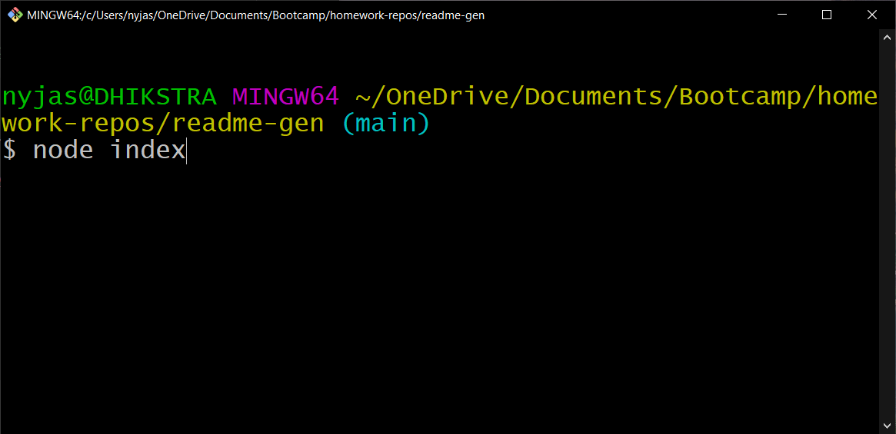
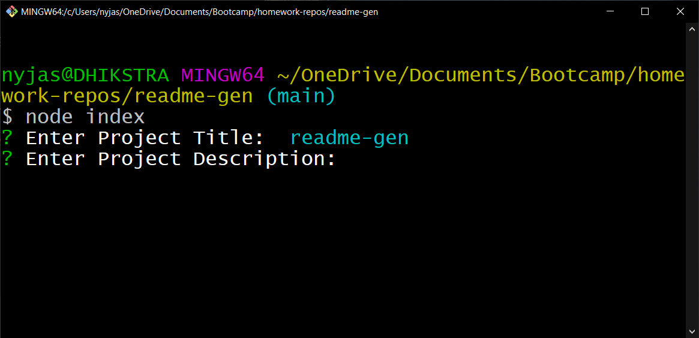
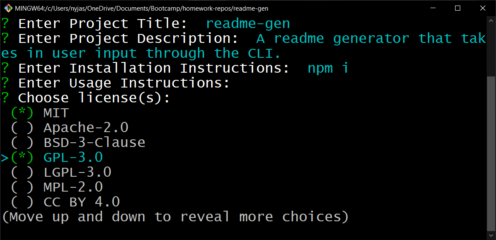
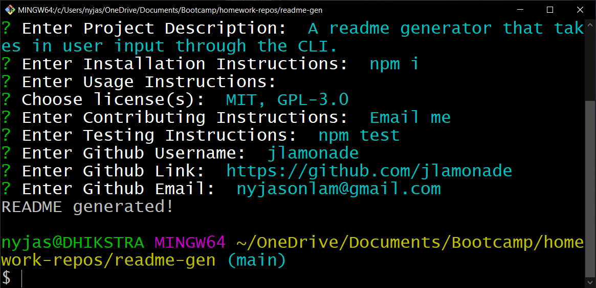

# readme-gen

[](https://opensource.org/licenses/MIT)

## Description

A readme generator that takes in user input through the CLI. Used to make writing READMEs easier and instantly deployable to github.

## Table of Contents

- [Installation](#installation)
- [Usage](#usage)
- [License](#license)
- [Contributing](#contributing)
- [Tests](#tests)
- [Questions](#questions)

## Installation

```npm i```

## Usage

[Walkthrough Video](https://drive.google.com/file/d/1xeVLYac1vEJei7UQ05BOqpWhJWr2uMCS/view)

```node index```









## License

This project is distrubuted under the following licenses:

[](https://opensource.org/licenses/MIT)

## Contributing

Email me

## Tests

## Questions

Github: [jlamonade](https://github.com/jlamonade)

Email: nyjasonlam@gmail.com
